# Spring PetClinic Microservices — Phase 2 Capstone


[](https://codespaces.new/tarwatkarkuntal315/spring-petclinic-microservices)

> **One command. Eleven containers. Full-stack observability. AI-powered chat.**
> `docker compose up -d` brings up the complete Spring PetClinic Microservices stack with health-gated startup ordering, distributed tracing, Grafana dashboards, and an OpenAI gpt-4o-mini chatbot — all in GitHub Codespaces.

---

## Table of Contents

- [Project Overview](#project-overview)
- [Architecture](#architecture)
- [Tech Stack](#tech-stack)
- [Services & Ports](#services--ports)
- [Prerequisites](#prerequisites)
- [Quick Start](#quick-start)
- [Health-Gated Startup Ordering](#health-gated-startup-ordering)
- [GenAI Integration](#genai-integration)
- [Observability Stack](#observability-stack)
  - [Prometheus](#prometheus)
  - [Grafana](#grafana)
  - [Zipkin Distributed Tracing](#zipkin-distributed-tracing)
- [Eureka Service Discovery](#eureka-service-discovery)
- [Testing](#testing)
- [Terraform IaC](#terraform-iac)
- [Project Structure](#project-structure)
- [Screenshots Gallery](#screenshots-gallery)
- [Blog Post](#blog-post)
- [DMI Cohort 2 Context](#dmi-cohort-2-context)
- [Author & Credits](#author--credits)
- [License](#license)

---

## Project Overview

**Spring PetClinic Microservices** is a distributed reference application built with Spring Boot and Spring Cloud. It decomposes the classic Spring PetClinic monolith into independently deployable services — each owning its own data, registering with a service discovery server, and receiving configuration from a centralized config server.

This repository is my **individual Phase 2 capstone** for the **DevOps Micro Internship (DMI) Cohort 2**, delivered by [The CloudAdvisory](https://dmi.pravinmishra.com) under the mentorship of Pravin Mishra (AWS Solutions Architect Professional).

### What this project demonstrates

| Capability | Implementation |
|---|---|
| Container orchestration | Docker Compose with 11 containers, health-gated startup ordering |
| Service communication | Spring Cloud Gateway routes all traffic; services discover each other via Eureka |
| Centralized configuration | Spring Cloud Config Server delivers config to all services at startup |
| AI-powered chat | Spring AI + OpenAI gpt-4o-mini with tool-calling for natural language CRUD |
| Full-stack observability | Prometheus metrics → Grafana dashboards + Zipkin distributed tracing |
| Infrastructure as Code | Terraform modules for VPC, IAM, ECR, EKS (validated, not applied) |
| Zero local setup | GitHub Codespaces — open the repo, run one command, done |

**Environment:** GitHub Codespaces (cloud dev environment — Docker, Git, and all tools pre-installed)  
**Branch:** `development`  
**Repo:** [https://github.com/tarwatkarkuntal315/spring-petclinic-microservices](https://github.com/tarwatkarkuntal315/spring-petclinic-microservices)

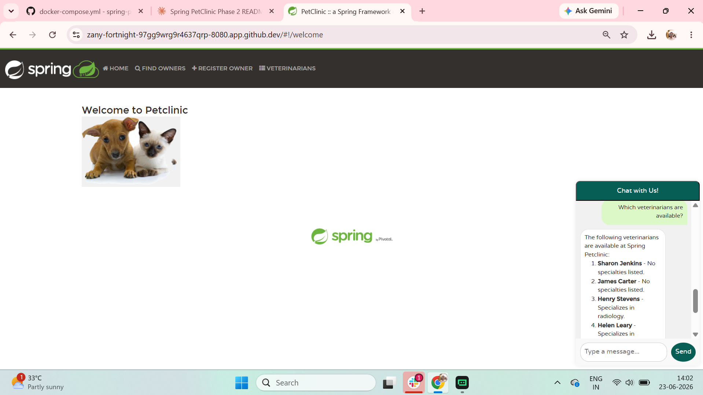
*PetClinic UI on port 8080 with the GenAI chat widget (bottom-right) — querying available veterinarians.*

---

## Architecture

The stack is organized into three layers. Docker Compose enforces strict startup ordering between layers using `condition: service_healthy`.

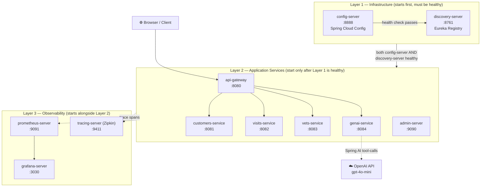

**Request flow:** Browser hits the API Gateway → Gateway routes to the correct business service → all span data is forwarded to Zipkin → Prometheus scrapes metrics every 15s → Grafana reads from Prometheus to render dashboards.

---

## Tech Stack

| Category | Technology | Version / Notes |
|---|---|---|
| Language | Java | 17 |
| Framework | Spring Boot | 4.0.1 |
| Cloud Framework | Spring Cloud | 2025.1.0 |
| Service Discovery | Spring Cloud Netflix Eureka | — |
| API Gateway | Spring Cloud Gateway | — |
| Configuration | Spring Cloud Config Server | — |
| AI Framework | Spring AI | 2.0.0-M1 |
| AI Model | OpenAI gpt-4o-mini | via OpenAI API |
| Containerization | Docker | 29.6.0 |
| Orchestration | Docker Compose | v2.40.3 |
| Metrics collection | Prometheus | — |
| Metrics instrumentation | Micrometer | — |
| Metrics visualization | Grafana | — |
| Distributed tracing | Zipkin | — |
| Service management | Spring Boot Admin | — |
| Health endpoints | Spring Boot Actuator | — |
| Infrastructure as Code | Terraform | validated, not applied |
| Development environment | GitHub Codespaces | zero local setup |

---

## Services & Ports

| Container | Port | Description | Layer |
|---|---|---|---|
| `config-server` | 8888 | Spring Cloud Config — serves centralized configuration to all services | 1 — Infrastructure |
| `discovery-server` | 8761 | Spring Cloud Netflix Eureka — service registry and discovery | 1 — Infrastructure |
| `api-gateway` | 8080 | Spring Cloud Gateway — single entry point for all client requests | 2 — Application |
| `customers-service` | 8081 | Manages owner and pet data | 2 — Application |
| `visits-service` | 8082 | Manages visit records for pets | 2 — Application |
| `vets-service` | 8083 | Manages the veterinarian directory | 2 — Application |
| `genai-service` | 8084 | AI-powered chat using OpenAI gpt-4o-mini via Spring AI | 2 — Application |
| `admin-server` | 9090 | Spring Boot Admin — service health and management dashboard | 2 — Application |
| `prometheus-server` | 9091 | Scrapes `/actuator/prometheus` from all Spring Boot services | 3 — Observability |
| `grafana-server` | 3030 | Metrics dashboards — HTTP latency, throughput, business metrics | 3 — Observability |
| `tracing-server` | 9411 | Zipkin — captures distributed traces across microservice boundaries | 3 — Observability |

---

## Prerequisites

**Option A — GitHub Codespaces (recommended, zero setup)**

Open this repo in Codespaces. Docker, Docker Compose, and Git are pre-installed. You only need an OpenAI API key.

[](https://codespaces.new/tarwatkarkuntal315/spring-petclinic-microservices)

**Option B — Local machine**

- Docker 29.x+ and Docker Compose v2.x+
- Git
- Bash (Linux / macOS / WSL2 on Windows)
- An OpenAI API key ([platform.openai.com](https://platform.openai.com))

---

## Quick Start

```bash
# 1. Clone and switch to the deployment branch
git clone https://github.com/tarwatkarkuntal315/spring-petclinic-microservices.git
cd spring-petclinic-microservices
git checkout development

# 2. Set your OpenAI API key (required for the GenAI service)
export OPENAI_API_KEY=your-openai-api-key-here

# 3. Start the full 11-container stack
docker compose up -d
```

> **Wait ~3 minutes** for the health-gated startup to complete. `config-server` must become healthy before `discovery-server` starts, and both must be healthy before the application services start.

### Verify the stack is up

```bash
docker compose ps
```

All 11 containers should show status `Up`.

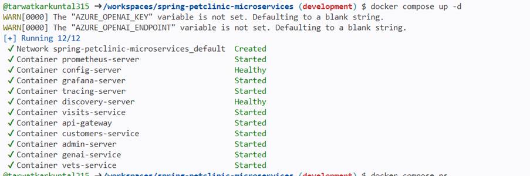
*Health-gated startup — services appear in order as dependencies become healthy.*

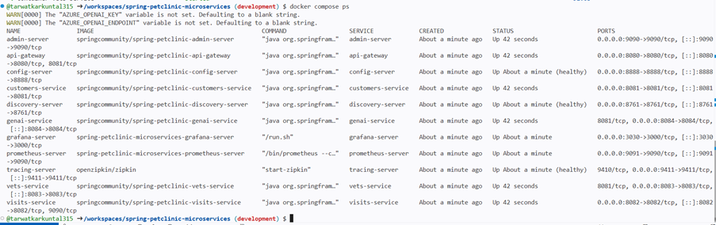
*All 11 containers running.*

### Access the services

| Service | URL | Notes |
|---|---|---|
| PetClinic UI | http://localhost:8080 | Main application — includes GenAI chat widget |
| Eureka Dashboard | http://localhost:8761 | Shows all registered services |
| Grafana | http://localhost:3030 | Metrics dashboards (no login required) |
| Prometheus | http://localhost:9091 | Targets page: all services UP |
| Zipkin | http://localhost:9411 | Distributed traces |
| Spring Boot Admin | http://localhost:9090 | Service health and management |

### Stop the stack

```bash
docker compose down
```

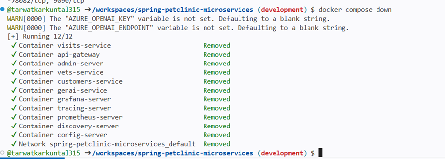
*Removes all 11 containers and the default network.*

---

## Health-Gated Startup Ordering

The most important orchestration feature of this deployment is that services **cannot start until their dependencies are provably healthy**. Without this, services crash on startup because they attempt to fetch configuration or register with Eureka before those servers are ready.

### How it works

Docker Compose's `depends_on` with `condition: service_healthy` blocks a service from starting until the dependency's `healthcheck` passes. This is different from the default `condition: service_started`, which only waits for the container process to launch — not for the application inside it to be ready.

### Startup sequence

```
Step 1:  config-server starts immediately (no dependencies)
         └── healthcheck: curl -I http://config-server:8888
             interval: 5s | timeout: 5s | retries: 10

Step 2:  discovery-server starts ONLY after config-server is healthy
         └── healthcheck: curl -f http://discovery-server:8761
             interval: 5s | timeout: 3s | retries: 10

Step 3:  All remaining 9 services start ONLY after BOTH
         config-server AND discovery-server are healthy:
         └── customers-service, visits-service, vets-service,
             genai-service, api-gateway, admin-server
             (tracing-server, grafana-server, prometheus-server
              have no depends_on and start immediately in parallel)
```

### docker-compose.yml excerpt

```yaml
config-server:
  image: springcommunity/spring-petclinic-config-server
  healthcheck:
    test: ["CMD", "curl", "-I", "http://config-server:8888"]
    interval: 5s
    timeout: 5s
    retries: 10
  ports:
    - 8888:8888

discovery-server:
  image: springcommunity/spring-petclinic-discovery-server
  depends_on:
    config-server:
      condition: service_healthy      # waits for config-server health check to pass
  healthcheck:
    test: ["CMD", "curl", "-f", "http://discovery-server:8761"]
    interval: 5s
    timeout: 3s
    retries: 10
  ports:
    - 8761:8761

customers-service:
  image: springcommunity/spring-petclinic-customers-service
  depends_on:
    config-server:
      condition: service_healthy      # waits for both before starting
    discovery-server:
      condition: service_healthy
  ports:
    - 8081:8081
```

This `depends_on` pattern is applied identically to `visits-service`, `vets-service`, `genai-service`, `api-gateway`, and `admin-server`.

### Why this matters

Without health-gated ordering, a common failure mode is:

1. `customers-service` starts before `config-server` is ready
2. It tries to fetch its configuration → connection refused
3. It crashes with a startup exception and enters a restart loop
4. `docker compose ps` shows the container as `Restarting`

Health gating eliminates this entirely — Docker Compose itself enforces readiness before allowing dependent containers to launch.

---

## GenAI Integration

The `genai-service` brings an AI-powered chat assistant directly into the PetClinic UI, built with [Spring AI](https://spring.io/projects/spring-ai) and backed by OpenAI's `gpt-4o-mini` model.

### Features

- **Natural language queries** — ask questions about the PetClinic data in plain English
- **Tool-calling CRUD** — the AI executes real backend REST API calls to read and write data:
  - `listOwners` — retrieves all pet owners
  - `listVets` — retrieves the veterinarian directory with specialties
  - `addPetToOwner` — adds a new pet for a named owner
  - `createVisit` — schedules a veterinary visit
- **Embedded chat widget** — appears in the bottom-right corner of every page in the PetClinic UI
- **Fully traced** — all Spring AI `chat_client` spans and tool-call invocations are captured in Zipkin

### Configuration

The service reads its OpenAI credentials from environment variables set in `docker-compose.yml`:

```yaml
genai-service:
  environment:
    - OPENAI_API_KEY=${OPENAI_API_KEY}
    - OPENAI_BASE_URL=${OPENAI_BASE_URL}
    - OPENAI_CHAT_MODEL=${OPENAI_CHAT_MODEL}
```

The `application.yml` defaults (used when env vars are not set):

```yaml
spring:
  ai:
    openai:
      api-key: ${OPENAI_API_KEY:demo}
      base-url: ${OPENAI_BASE_URL:https://api.openai.com}
      chat:
        options:
          model: ${OPENAI_CHAT_MODEL:gpt-4o-mini}
          temperature: 0.7
```

### Example queries

| Natural language query | What the AI does |
|---|---|
| `"Which veterinarians are available?"` | Calls `listVets`, returns names and specialties |
| `"Show me all pet owners"` | Calls `listOwners`, returns the full owner list |
| `"Add a dog named Iggy for owner Pravin Gupta"` | Calls `addPetToOwner` with owner lookup |

### Screenshots


*Chat widget responding to "Which veterinarians are available?" — tool-call in progress.*

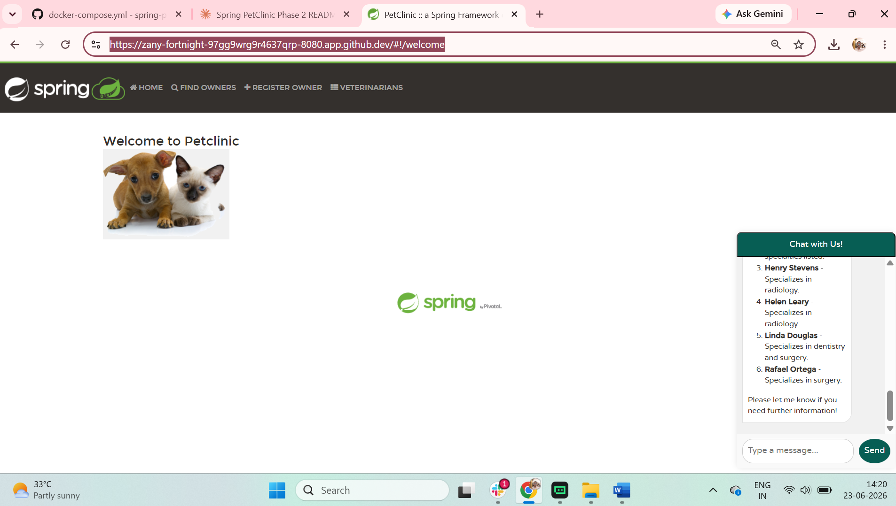
*Full veterinarian list returned by the AI with specialties.*

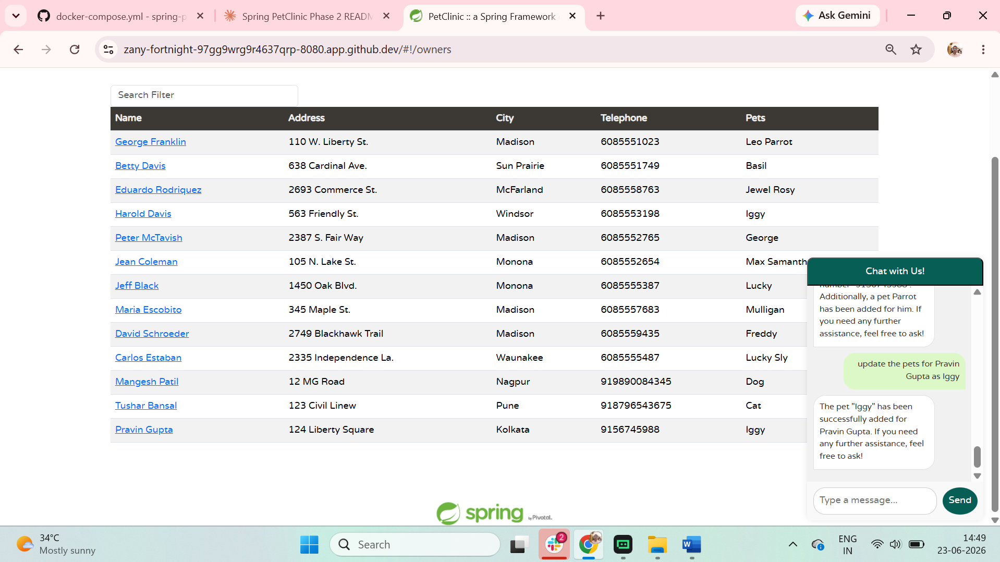
*AI executes `addPetToOwner` tool-call — pet "Iggy" added via natural language.*

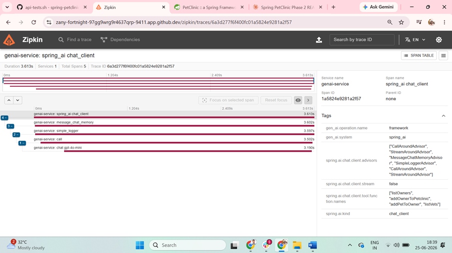
*Zipkin trace showing `spring_ai chat_client` spans and tool function names.*

---

## Observability Stack

Three observability containers provide complete visibility into the running system — with zero manual configuration after `docker compose up`.

### Prometheus

Prometheus scrapes the `/actuator/prometheus` endpoint exposed by every Spring Boot service. This is enabled via:

- `micrometer-registry-prometheus` on the classpath of each service
- `management.endpoints.web.exposure.include` configured in the centralized Config Server
- Scrape targets defined in `docker/prometheus/prometheus.yml` using container names on the Docker bridge network

The **Targets** page at `http://localhost:9091/targets` shows all services with status `UP` and last scrape timestamps.

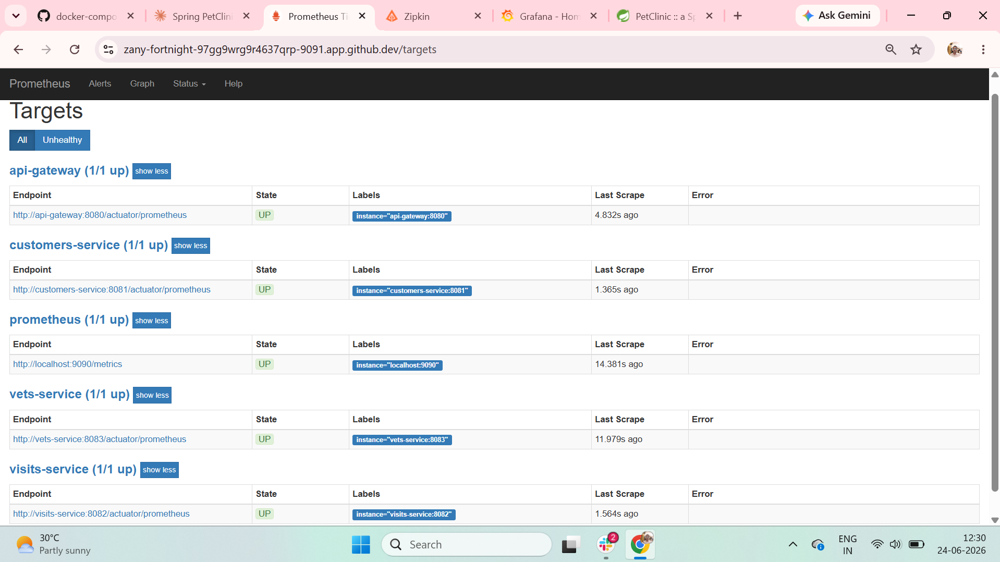
*All Spring Boot services reporting healthy to Prometheus.*

### Grafana

Grafana runs with a pre-provisioned Prometheus datasource (`docker/grafana/provisioning/datasources/`) and a pre-loaded **Spring PetClinic Metrics** dashboard (`docker/grafana/provisioning/dashboards/`). No login or manual setup is required.

**Dashboard panels:**

| Panel | Metric captured |
|---|---|
| HTTP Request Latency | p50 / p95 / p99 across all services |
| HTTP Request Activity | Request throughput per service |
| Owners Updated | 256 update operations recorded |
| Owners Created | 257 new owner registrations |
| Pets Created | 262 new pets registered |
| Visit Created | 1 visit scheduled |
| SPC Business Histogram | Create / update operations over time |

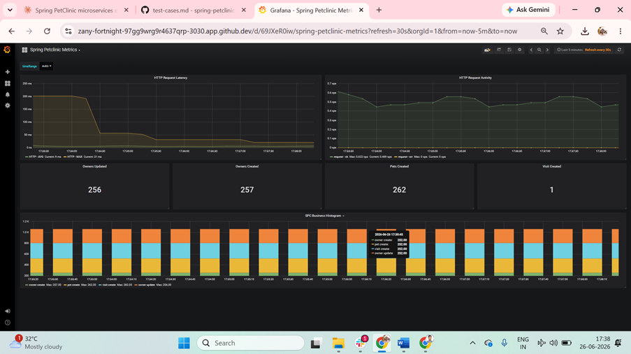
*Live Grafana dashboard showing business metrics from the test data population run.*

### Zipkin Distributed Tracing

Zipkin captures the full request lifecycle as it crosses microservice boundaries. Every Spring Boot service sends trace spans to `http://tracing-server:9411/api/v2/spans` with 100% sampling (`MANAGEMENT_TRACING_SAMPLING_PROBABILITY=1.0`).

**What gets traced:**

- Browser → `api-gateway` → business service → response
- `api-gateway` → `genai-service` → Spring AI `chat_client` → tool-call invocations → backend services
- Each hop becomes a child span; the full trace tree is visible in the Zipkin UI

**Example trace — GenAI request (4.010s, 3 spans):**

```
api-gateway      http post              4.010s  ← root span
  └── genai-service                     3.980s
        └── spring_ai chat_client       3.750s
              ├── listOwners  (tool call)
              └── addPetToOwner  (tool call)
```

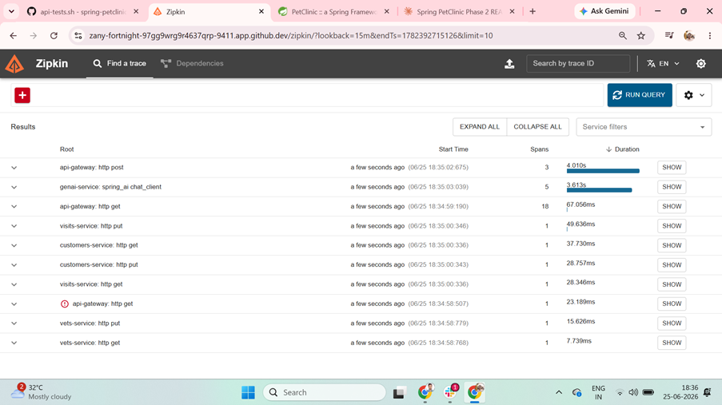
*All distributed traces captured — each row shows service count and total duration.*

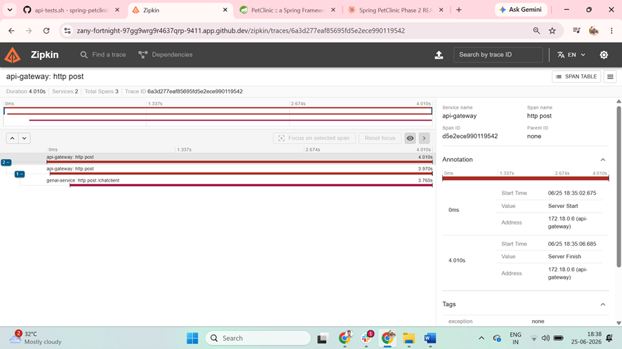
*API Gateway trace spanning 2 services and 3 spans over 4.010 seconds.*

---

## Eureka Service Discovery

The `discovery-server` runs Spring Cloud Netflix Eureka and acts as the service registry. When a Spring Boot application starts, it self-registers with Eureka using its application name and IP. The API Gateway uses Eureka to resolve service locations for routing.

### Registered services

Five of the 11 containers register with Eureka:

| Container | Eureka App Name | Registers? | Reason |
|---|---|---|---|
| `api-gateway` | `API-GATEWAY` | Yes | Routes traffic using Eureka service IDs |
| `customers-service` | `CUSTOMERS-SERVICE` | Yes | Business service |
| `visits-service` | `VISITS-SERVICE` | Yes | Business service |
| `vets-service` | `VETS-SERVICE` | Yes | Business service |
| `genai-service` | `GENAI-SERVICE` | Yes | Business service |
| `config-server` | — | No | Infrastructure — it IS the config source |
| `discovery-server` | — | No | Infrastructure — it IS the registry |
| `admin-server` | — | No | Monitoring tool, not a business service |
| `prometheus-server` | — | No | Not a Spring Boot Eureka client |
| `grafana-server` | — | No | Not a Spring Boot Eureka client |
| `tracing-server` | — | No | Not a Spring Boot Eureka client |

### Screenshots

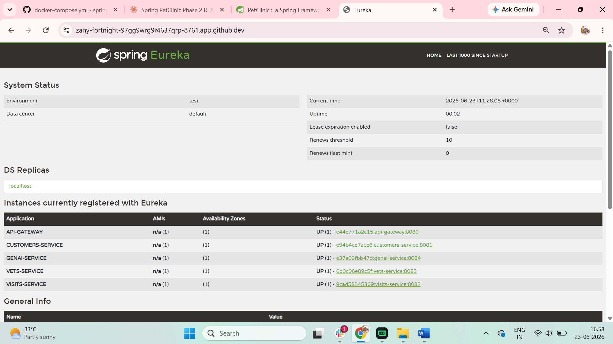
*Eureka dashboard — all 5 application services registered and UP.*

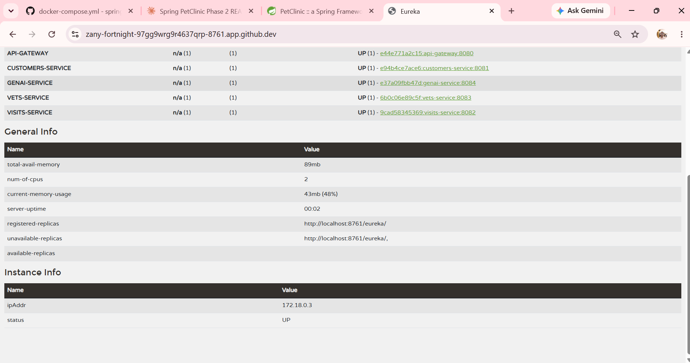
*Eureka general info panel showing instance details and memory usage.*

---

## Testing

**23 integration tests across 6 test layers — all passing.**

Tests were executed in GitHub Codespaces against the live 11-container Docker Compose stack.

| Layer | Test ID | Test Name | Result |
|---|---|---|---|
| **L1 — IaC** | IaC-01 | `terraform validate` passes without errors | ✅ PASS |
| **L1 — IaC** | IaC-02 | `terraform plan` generates valid execution plan | ✅ PASS |
| **L1 — IaC** | IaC-03 | K8s namespace manifest parses with `kubectl --dry-run` | ✅ PASS |
| **L1 — IaC** | IaC-04 | K8s service manifests lint (all 29 manifests valid) | ✅ PASS |
| **L1 — IaC** | IaC-05 | K8s deployment manifests lint | ✅ PASS |
| **L2 — Health** | HC-01 | `config-server` `/actuator/health` returns 200 | ✅ PASS |
| **L2 — Health** | HC-02 | `discovery-server` `/actuator/health` returns 200 | ✅ PASS |
| **L2 — Health** | HC-03 | `api-gateway` `/actuator/health` returns 200 | ✅ PASS |
| **L2 — Health** | HC-04 | `customers-service` `/actuator/health` returns 200 | ✅ PASS |
| **L2 — Health** | HC-05 | `visits-service` `/actuator/health` returns 200 | ✅ PASS |
| **L2 — Health** | HC-06 | `vets-service` `/actuator/health` returns 200 | ✅ PASS |
| **L2 — Health** | HC-07 | `genai-service` `/actuator/health` returns 200 | ✅ PASS |
| **L3 — API** | API-01 | PetClinic homepage loads (GET `/`) returns 200 | ✅ PASS |
| **L3 — API** | API-02 | Owners list (GET `/api/customer/owners`) returns owner array | ✅ PASS |
| **L3 — API** | API-03 | Vets list (GET `/api/vet/vets`) returns vet array | ✅ PASS |
| **L3 — API** | API-04 | Visits endpoint (GET `/api/visit/owners/1/pets/1/visits`) returns 200 | ✅ PASS |
| **L3 — API** | API-05 | Register new owner (POST `/api/customer/owners`) succeeds | ✅ PASS |
| **L3 — API** | API-06 | GenAI read query — "list all vets" returns AI response | ✅ PASS |
| **L3 — API** | API-07 | GenAI write query — "add pet for owner" executes tool-call | ✅ PASS |
| **L4 — Observability** | OBS-01 | Prometheus targets page — all services status `UP` | ✅ PASS |
| **L4 — Observability** | OBS-02 | Grafana dashboard loads with live metrics data | ✅ PASS |
| **L4 — Tracing** | OBS-03 | Zipkin captures traces across all services including GenAI tool-calls | ✅ PASS |
| **L5 — Resilience** | RES-01 | Stop `customers-service`, restart, re-registers in Eureka within 30s | ✅ PASS |

**Total: 23/23 PASS**

### Run the API test script

```bash
bash scripts/api-tests.sh
```

Tests API-01 through API-04 automatically. Exits with code `0` on all pass, `1` on any failure.

### Test documentation

- Full test case definitions: [`docs/test-cases.md`](docs/test-cases.md)
- Executed test results with evidence: [`docs/test-results.md`](docs/test-results.md)

---

## Terraform IaC

Terraform infrastructure code in `infra/` provisions the AWS resources needed to run this application on EKS. The code has been fully written and validated but **was not applied** due to zero AWS budget.

### Module structure

```
infra/
├── main.tf                   # Root module — wires together all modules
├── versions.tf               # AWS provider version constraints
├── variables.tf              # Input variables (region, cluster name, etc.)
├── outputs.tf                # Output values (cluster endpoint, ECR URLs)
├── .terraform.lock.hcl       # Provider dependency lock file
└── modules/
    ├── vpc/                  # VPC, subnets, route tables, internet gateway
    ├── iam/                  # IAM roles and policies for EKS and node groups
    ├── ecr/                  # ECR repositories — one per microservice
    └── eks/                  # EKS cluster and managed node groups
```

### Validation status

| Command | Status | Notes |
|---|---|---|
| `terraform init` | Passed | Providers downloaded and initialized |
| `terraform validate` | **Passed** | No configuration errors |
| `terraform plan` | **Passed** | Valid execution plan generated |
| `terraform apply` | **Not run** | Zero AWS budget — no live infrastructure provisioned |

> **Honest disclosure:** The Terraform code is production-ready and has been validated end-to-end (`validate` + `plan`), but was **never applied** to live AWS. This deployment runs entirely on Docker Compose in GitHub Codespaces. The IaC is included to demonstrate infrastructure design skills and production-readiness thinking — not to claim a live AWS deployment.

---

## Project Structure

```
spring-petclinic-microservices/
│
├── docker-compose.yml                      # 11-container stack with health-gated startup
│
├── spring-petclinic-config-server/         # Layer 1: Centralized configuration (port 8888)
├── spring-petclinic-discovery-server/      # Layer 1: Eureka service registry (port 8761)
│
├── spring-petclinic-api-gateway/           # Layer 2: Spring Cloud Gateway (port 8080)
├── spring-petclinic-customers-service/     # Layer 2: Owners and pets (port 8081)
├── spring-petclinic-visits-service/        # Layer 2: Visit records (port 8082)
├── spring-petclinic-vets-service/          # Layer 2: Veterinarian directory (port 8083)
├── spring-petclinic-genai-service/         # Layer 2: OpenAI gpt-4o-mini chatbot (port 8084)
├── spring-petclinic-admin-server/          # Layer 2: Spring Boot Admin (port 9090)
│
├── docker/
│   ├── prometheus/
│   │   └── prometheus.yml                  # Scrape config for all Spring Boot services
│   └── grafana/
│       └── provisioning/
│           ├── dashboards/                 # Pre-loaded Spring PetClinic Metrics dashboard
│           └── datasources/               # Auto-configured Prometheus datasource
│
├── infra/                                  # Terraform IaC (validated, not applied)
│   └── modules/
│       ├── vpc/  iam/  ecr/  eks/
│
├── k8s/                                    # Kubernetes manifests (EKS deployment target)
│   ├── namespace.yaml
│   ├── [service-name]/
│   │   ├── deployment.yaml
│   │   └── service.yaml
│   ├── monitoring/                         # Prometheus, Grafana, Zipkin K8s manifests
│   └── mysql/                              # Database manifests
│
├── scripts/
│   ├── api-tests.sh                        # Automated API integration tests (L3)
│   └── health-check.sh                     # Service health verification
│
└── docs/
    ├── test-cases.md                       # 5-layer test case definitions
    ├── test-results.md                     # Executed results with evidence
    └── images/                             # All screenshots (01–12, B2-S1–B2-S7)
```

---

## Screenshots Gallery

### Application UI

| Screenshot | Description |
|---|---|
|  | PetClinic welcome page with GenAI chat widget — querying available vets |
|  | GenAI complete vets list response with specialties |
| 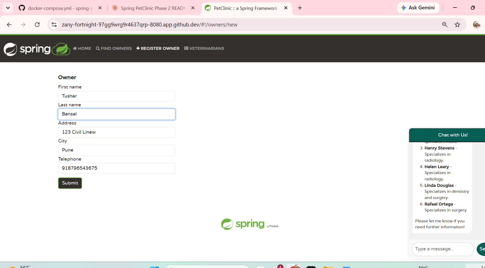 | Register new owner form — Tushar Bansal, Pune |
| 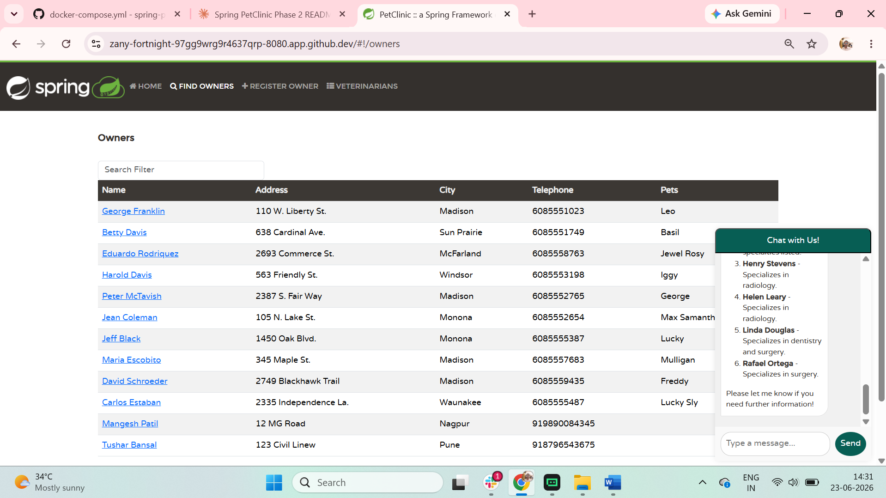 | Full owners list showing registered owners with pets |
|  | GenAI adding pet "Iggy" for owner Pravin Gupta via tool-calling |

### Eureka Service Discovery

| Screenshot | Description |
|---|---|
|  | Eureka dashboard — 5 services registered, all UP |
|  | Eureka general info, instance details, memory usage |

### Observability Stack

| Screenshot | Description |
|---|---|
|  | Prometheus targets page — all services UP, last scrape times shown |
|  | Grafana Spring PetClinic Metrics with live data (256 owners, 262 pets) |
|  | Zipkin trace list — distributed traces across all services |
|  | API Gateway trace detail — 4.010s, 2 services, 3 spans |
|  | GenAI trace — `spring_ai chat_client` spans with tool function names |

### Docker Compose Terminal

| Screenshot | Description |
|---|---|
| 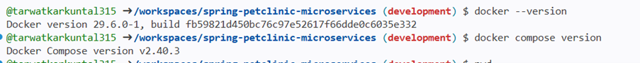 | Docker 29.6.0, Compose v2.40.3 version verification |
|  | `docker compose up -d` — health-gated startup output |
|  | `docker compose ps` — all 11 containers Up |
|  | `docker compose down` — removes all 11 containers + network |

---

## Blog Post

Read the full technical walkthrough of this deployment on Hashnode:

**[One Command, Eleven Containers: Deploying Spring PetClinic Microservices with Docker Compose](https://cloudnativewithkuntal.hashnode.dev/one-command-eleven-containers-deploying-spring-petclinic-microservices-with-docker-compose)**

Covers the health-gated startup design decisions, GenAI tool-calling implementation, observability stack configuration, and lessons learned from the DMI program.

---

## DMI Cohort 2 Context

### Phase 1 — Team Deployment (AWS EKS)

Phase 1 was a team project delivered by **DevOps Titra**, a 9-engineer team within DMI Cohort 2.

| Item | Detail |
|---|---|
| Team | DevOps Titra (9 members) |
| Deployment target | AWS EKS with ECR |
| My roles | **Team Lead & Scrum Master** + **Observability & Monitoring Engineer** |
| Team repo | [https://github.com/PetClinic-Project-Team/spring-petclinic-microservices](https://github.com/PetClinic-Project-Team/spring-petclinic-microservices) |

As Observability & Monitoring Engineer, I owned the Prometheus scrape configuration, Grafana dashboard provisioning, and Zipkin distributed tracing integration for the team's AWS EKS deployment.

### Phase 2 — Individual Deployment (this repo)

Phase 2 required each intern to independently deploy the full stack, demonstrating personal mastery of the toolchain without team scaffolding.

| Item | Detail |
|---|---|
| Deployment | Docker Compose in GitHub Codespaces |
| Containers | 11 (complete stack including observability) |
| Tests | 23/23 passing |
| Environment | GitHub Codespaces — zero local setup required |

### Program

- **Mentor:** Pravin Mishra — AWS Solutions Architect Professional
- **Program:** DevOps Micro Internship (DMI) — [dmi.pravinmishra.com](https://dmi.pravinmishra.com)
- **Organization:** The CloudAdvisory

---

## Author & Credits

**Kuntal Tarwatkar**  
Team Lead & Scrum Master | Observability & Monitoring Engineer — DMI Cohort 2

- GitHub: [https://github.com/tarwatkarkuntal315](https://github.com/tarwatkarkuntal315)
- LinkedIn: [https://www.linkedin.com/in/kuntal-tarwatkar-413653102/](https://www.linkedin.com/in/kuntal-tarwatkar-413653102/)
- Blog: [https://cloudnativewithkuntal.hashnode.dev](https://cloudnativewithkuntal.hashnode.dev)

**Mentor**  
Pravin Mishra — AWS Solutions Architect Professional, Founder of The CloudAdvisory

**Upstream project**  
This project is derived from the open-source [spring-petclinic/spring-petclinic-microservices](https://github.com/spring-petclinic/spring-petclinic-microservices) reference application.

---

## License

This project is licensed under the **Apache License 2.0**. See the [LICENSE](LICENSE) file for the full license text.

[](LICENSE)
